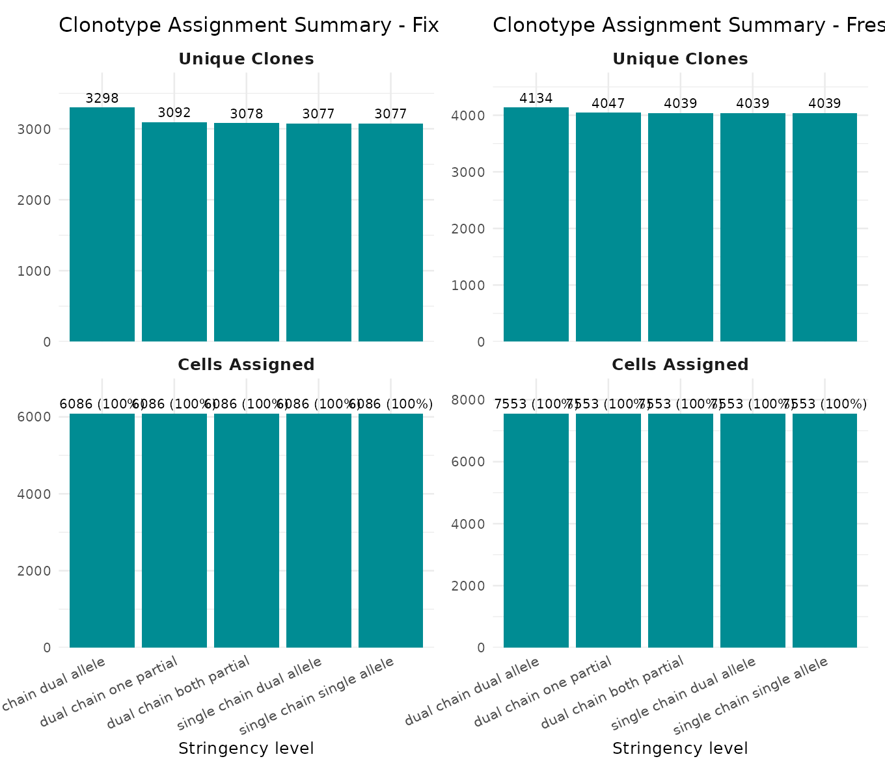
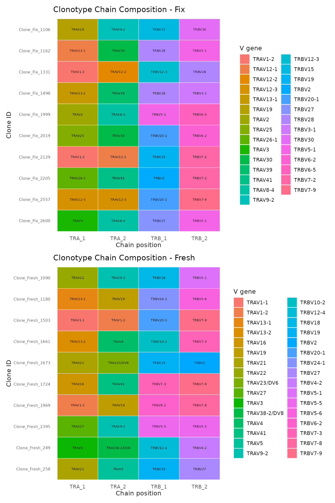
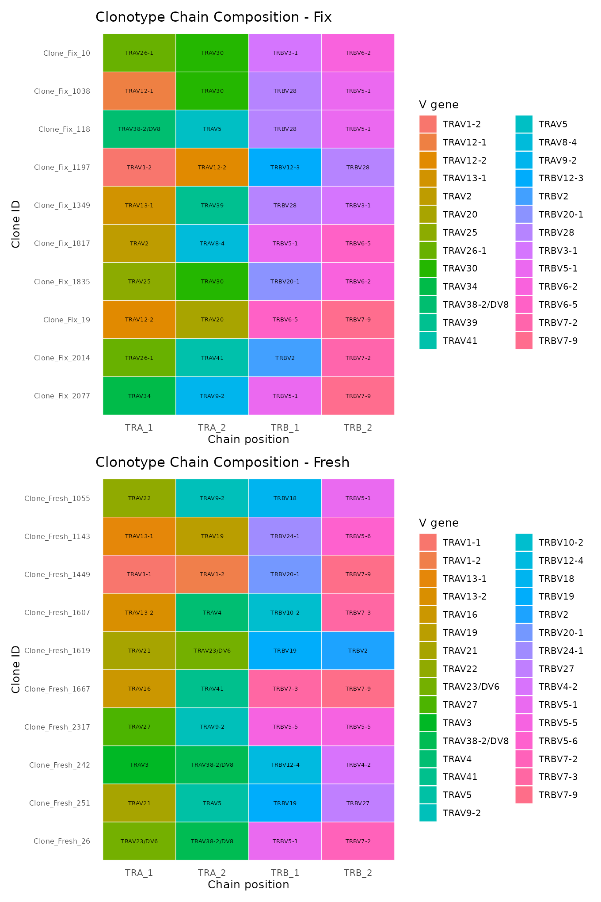
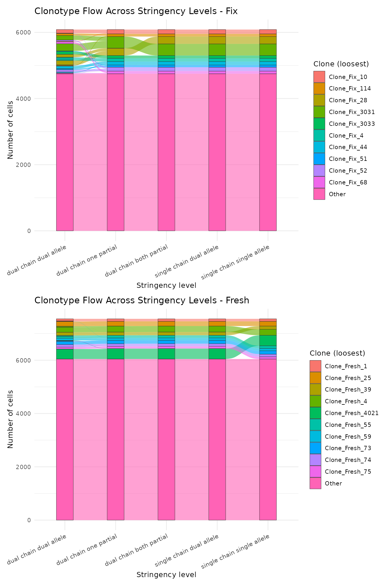

# Getting Started with VDJigsaw

## Introduction

This vignette walks you through a typical VDJigsaw workflow using
real-world VDJ data from 10x Genomics. By the end, you will have
assigned clonotypes at multiple stringency levels and visualized the
results.

**What does VDJigsaw do?** Single-cell TCR sequencing often suffers from
dropout: a cell’s second alpha or beta chain allele may simply not get
captured. Most tools treat missing chains as “different”, fragmenting
clonotypes. VDJigsaw instead looks across the whole dataset to puzzle
together which cells likely belong to the same clone, even when some
chain data is missing. It does this at five levels of stringency, from
strict (all four chains must match) to permissive (a single allele
suffices).

## Getting started

``` r
library(VDJigsaw)
library(dplyr)
library(ggplot2)
library(patchwork)
```

## Load data

To illustrate VDJigsaw, we use VDJ filtered contig data from two
publicly available 10x Genomics datasets:

1.  **10k Human Diseased PBMCs (ALL) — Freshly Processed**
    ([dataset](https://www.10xgenomics.com/datasets/10k_5p_Human_diseased_PBMC_ALL_Fresh)
    \| [VDJ-TCR
    contigs](https://cf.10xgenomics.com/samples/cell-vdj/8.0.1/10k_5p_Human_diseased_PBMC_ALL_Fresh/10k_5p_Human_diseased_PBMC_ALL_Fresh_vdj_t_filtered_contig_annotations.csv))

2.  **10k Human Diseased PBMCs (ALL) — Fixed and Stored**
    ([dataset](https://www.10xgenomics.com/datasets/10k_5p_Human_diseased_PBMC_ALL_Fix_stored)
    \| [VDJ-TCR
    contigs](https://cf.10xgenomics.com/samples/cell-vdj/8.0.1/10k_5p_Human_diseased_PBMC_ALL_Fix_stored/10k_5p_Human_diseased_PBMC_ALL_Fix_stored_vdj_t_filtered_contig_annotations.csv))

These CSV files are bundled with the package in `inst/extdata/`.

``` r
VDJ.contigs.fresh <- read.csv(system.file(
  "extdata",
  "10k_5p_Human_diseased_PBMC_ALL_Fresh_vdj_t_filtered_contig_annotations.csv",
  package = "VDJigsaw"))

VDJ.contigs.fix <- read.csv(system.file(
  "extdata",
  "10k_5p_Human_diseased_PBMC_ALL_Fix_stored_vdj_t_filtered_contig_annotations.csv",
  package = "VDJigsaw"))
```

For simplicity, we tag each dataset with a sample label and combine
them:

``` r
VDJ.contigs.fresh$orig.ident <- "Fresh"
VDJ.contigs.fix$orig.ident   <- "Fix"
VDJ.contigs <- rbind(VDJ.contigs.fresh, VDJ.contigs.fix)
```

Let’s take a quick look at the raw data — each row is one contig (one
chain from one cell):

``` r
cat(nrow(VDJ.contigs), "contigs across", length(unique(VDJ.contigs$barcode)), "unique barcodes\n")
```

    ## 27129 contigs across 13634 unique barcodes

``` r
knitr::kable(head(VDJ.contigs[, c("barcode", "chain", "v_gene", "cdr3", "j_gene", "umis", "orig.ident")], 5))
```

| barcode            | chain | v_gene   | cdr3               | j_gene  | umis | orig.ident |
|:-------------------|:------|:---------|:-------------------|:--------|-----:|:-----------|
| AAACCAAAGAACAGAC-1 | TRB   | TRBV20-1 | CSARDLYRGRETQYF    | TRBJ2-5 |   25 | Fresh      |
| AAACCAAAGAACAGAC-1 | TRA   | TRAV8-4  | CAVSDRQYSGGGADGLTF | TRAJ45  |   10 | Fresh      |
| AAACCAAAGAACAGAC-1 | TRA   | TRAV19   | CALSGQTSGTYKYIF    | TRAJ40  |   11 | Fresh      |
| AAACCAAAGCAAGATA-1 | TRA   | TRAV30   | CGTYNSGNTGKLIF     | TRAJ37  |   10 | Fresh      |
| AAACCAAAGCAAGATA-1 | TRB   | TRBV11-2 | CASSLGRGRVAYEQFF   | TRBJ2-1 |    7 | Fresh      |

## Run the pipeline

The main function
[`assign_clonotype()`](https://doRemy.github.io/VDJigsaw/reference/assign_clonotype.md)
runs the full VDJigsaw pipeline in four steps:

1.  **Pivot** the long-format contigs into wide format (one row per
    cell, with TRA_1, TRA_2, TRB_1, TRB_2 columns)
2.  **Validate** TCR chains (fix ordering, remove duplicates, flag
    invalid sequences)
3.  **Identify clonotypes** at five stringency levels using graph-based
    clustering
4.  **Return** annotated data and reference tables

You can set `sample_col` to tell VDJigsaw about your sample structure.
The `clone_loose` parameter controls which stringency level becomes the
default `CloneID`. Set `num_cores` to speed up processing when you have
multiple samples (use `-1` for all available cores).

> **Tip:** Ideally, run VDJigsaw after quality control of your scRNA-seq
> data to remove low-quality barcodes and doublets, which could skew
> clonotype assignments.

``` r
VDJigsaw_res <- assign_clonotype(
  VDJ_data = VDJ.contigs,
  sample_col = "orig.ident",
  clone_loose = "single_chain_single_allele",
  num_cores = 1,
  verbose = TRUE)
```

    ## [VDJigsaw] ========================================

    ## [VDJigsaw] Starting VDJigsaw clonotype assignment

    ## [VDJigsaw] ========================================

    ## [VDJigsaw] Converting VDJ data to wide format...

    ## [VDJigsaw]   Using cdr3_nt for CDR3 chain identifier

    ## [VDJigsaw]   Pivoting to wide format...

    ## [VDJigsaw]   Wide format: 13639 unique barcodes

    ## [VDJigsaw]   Creating TRA/TRB chain columns...

    ## [VDJigsaw] Wide format conversion complete: 98 columns

    ## [VDJigsaw] Validating and correcting TCR data...

    ## [VDJigsaw] Removed 1 duplicate alleles (allele 1 == allele 2)

    ## [VDJigsaw] Swapped 8 alleles where allele_2 was defined but allele_1 was not

    ## [VDJigsaw] TCR data correction complete

    ## [VDJigsaw] Identifying clonotypes and building reference tables...

    ## [VDJigsaw] Checking inputs...

    ## [VDJigsaw] Processing 13639 cells across 2 sample(s)

    ## [VDJigsaw] Using 1 core(s) for parallel processing

    ## [VDJigsaw] Combining results from parallel processing...

    ## [VDJigsaw]   dual_chain_dual_allele: 7432 clonotypes identified

    ## [VDJigsaw]   dual_chain_one_partial: 7139 clonotypes identified

    ## [VDJigsaw]   dual_chain_both_partial: 7117 clonotypes identified

    ## [VDJigsaw]   single_chain_dual_allele: 7116 clonotypes identified

    ## [VDJigsaw]   single_chain_single_allele: 7116 clonotypes identified

    ## [VDJigsaw] Clonotype identification complete!

    ## [VDJigsaw] ========================================

    ## [VDJigsaw] Pipeline complete!

    ## [VDJigsaw] Assigned 13639 of 13639 cells (100%) to clonotypes

    ## [VDJigsaw] ========================================

The result is a list with two elements:

- **`TCR_data`** — wide-format data frame (one row per cell) with TCR
  chains and clone IDs at every stringency level
- **`ref_tables`** — named list of reference tables mapping each
  `CloneID` to its chain composition

## Explore the outputs

### TCR data

The `TCR_data` table has one row per cell barcode, with clone IDs at
every stringency level:

``` r
TCR_data <- VDJigsaw_res$TCR_data
cat(nrow(TCR_data), "cells,", ncol(TCR_data), "columns\n")
```

    ## 13639 cells, 109 columns

Here are the clone ID columns — each cell gets an assignment at every
stringency level:

``` r
clone_cols <- colnames(TCR_data)[grepl("^CloneID\\.", colnames(TCR_data))]
knitr::kable(head(TCR_data[, c("Sample", "barcode", clone_cols)], 6))
```

| Sample | barcode            | CloneID.dual_chain_dual_allele | CloneID.loose | CloneID.dual_chain_one_partial | CloneID.dual_chain_both_partial | CloneID.single_chain_dual_allele | CloneID.single_chain_single_allele |
|:-------|:-------------------|:-------------------------------|:--------------|:-------------------------------|:--------------------------------|:---------------------------------|:-----------------------------------|
| Fresh  | AAACCAAAGAACAGAC-1 | Clone_Fresh_1                  | Clone_Fresh_1 | Clone_Fresh_1                  | Clone_Fresh_1                   | Clone_Fresh_1                    | Clone_Fresh_1                      |
| Fresh  | AAACCAAAGCAAGATA-1 | Clone_Fresh_2                  | Clone_Fresh_2 | Clone_Fresh_2                  | Clone_Fresh_2                   | Clone_Fresh_2                    | Clone_Fresh_2                      |
| Fresh  | AAACCAAAGCTGGTTA-1 | Clone_Fresh_3                  | Clone_Fresh_3 | Clone_Fresh_3                  | Clone_Fresh_3                   | Clone_Fresh_3                    | Clone_Fresh_3                      |
| Fresh  | AAACCAGCACCTAACG-1 | Clone_Fresh_4                  | Clone_Fresh_4 | Clone_Fresh_4                  | Clone_Fresh_4                   | Clone_Fresh_4                    | Clone_Fresh_4                      |
| Fresh  | AAACCAGCACGCGTTA-1 | Clone_Fresh_5                  | Clone_Fresh_5 | Clone_Fresh_5                  | Clone_Fresh_5                   | Clone_Fresh_5                    | Clone_Fresh_5                      |
| Fresh  | AAACCAGCACTAGGAA-1 | Clone_Fresh_6                  | Clone_Fresh_6 | Clone_Fresh_6                  | Clone_Fresh_6                   | Clone_Fresh_6                    | Clone_Fresh_6                      |

### Reference tables

The `ref_tables` list contains one reference table per stringency level.
Each table maps a `CloneID` to its TCR chain composition.

``` r
VDJigsaw_ref_tables <- VDJigsaw_res$ref_tables
names(VDJigsaw_ref_tables)
```

    ## [1] "dual_chain_dual_allele"     "dual_chain_one_partial"    
    ## [3] "dual_chain_both_partial"    "single_chain_dual_allele"  
    ## [5] "single_chain_single_allele" "loose"

Each reference table has columns for `CloneID`, `Sample`, and the TCR
chains. Let’s define a small helper to display them compactly (showing
only the V gene part of each chain to save space):

``` r
# Helper: show ref table with truncated chain names for readability
show_ref <- function(ref_tbl, n = 5) {
  display_cols <- intersect(c("CloneID", "Sample", "TRA_1", "TRA_2", "TRB_1", "TRB_2"), colnames(ref_tbl))
  df <- head(ref_tbl[, display_cols], n)
  # Shorten V_CDR3_J strings to just V gene for display
  for (col in intersect(c("TRA_1", "TRA_2", "TRB_1", "TRB_2"), colnames(df))) {
    df[[col]] <- ifelse(is.na(df[[col]]), NA, sub("_.*", "", df[[col]]))
  }
  knitr::kable(df, row.names = FALSE)
}
```

#### Stringency levels

The stringency levels are named along two axes: **which chains are
required** (both alpha and beta, or just one) and **how many alleles per
chain** (both alleles, or just one).

| Level | Name                         | Chains required     | Alleles per chain                    |
|-------|------------------------------|---------------------|--------------------------------------|
| 1     | `dual_chain_dual_allele`     | Both alpha and beta | Both alleles (1 and 2)               |
| 2     | `dual_chain_one_partial`     | Both alpha and beta | One chain can have a single allele   |
| 3     | `dual_chain_both_partial`    | Both alpha and beta | Both chains can have a single allele |
| 4     | `single_chain_dual_allele`   | alpha or beta alone | Both alleles (1 and 2)               |
| 5     | `single_chain_single_allele` | alpha or beta alone | A single allele suffices             |

##### dual_chain_dual_allele

The strictest level. All four chain positions (`TRA_1`, `TRA_2`,
`TRB_1`, `TRB_2`) must match exactly.

``` r
cat(nrow(VDJigsaw_ref_tables$dual_chain_dual_allele), "clonotypes\n")
```

    ## 7432 clonotypes

``` r
show_ref(VDJigsaw_ref_tables$dual_chain_dual_allele)
```

| CloneID          | Sample | TRA_1    | TRA_2   | TRB_1    | TRB_2 |
|:-----------------|:-------|:---------|:--------|:---------|:------|
| Clone_Fresh_1    | Fresh  | TRAV19   | TRAV8-4 | TRBV20-1 | NA    |
| Clone_Fresh_10   | Fresh  | TRAV6    | NA      | TRBV20-1 | NA    |
| Clone_Fresh_100  | Fresh  | TRAV12-1 | TRAV21  | TRBV19   | NA    |
| Clone_Fresh_1000 | Fresh  | TRAV8-6  | NA      | TRBV28   | NA    |
| Clone_Fresh_1001 | Fresh  | TRAV8-6  | NA      | TRBV20-1 | NA    |

##### dual_chain_one_partial

Both chains required, but one chain may have a missing secondary allele
(no conflict allowed).

``` r
cat(nrow(VDJigsaw_ref_tables$dual_chain_one_partial), "clonotypes\n")
```

    ## 7139 clonotypes

``` r
show_ref(VDJigsaw_ref_tables$dual_chain_one_partial)
```

| CloneID          | Sample | TRA_1   | TRA_2   | TRB_1    | TRB_2 |
|:-----------------|:-------|:--------|:--------|:---------|:------|
| Clone_Fresh_1    | Fresh  | TRAV19  | TRAV8-4 | TRBV20-1 | NA    |
| Clone_Fresh_10   | Fresh  | TRAV6   | NA      | TRBV20-1 | NA    |
| Clone_Fresh_100  | Fresh  | TRAV1-2 | NA      | TRBV6-5  | NA    |
| Clone_Fresh_1000 | Fresh  | TRAV19  | NA      | TRBV6-5  | NA    |
| Clone_Fresh_1001 | Fresh  | TRAV1-2 | NA      | TRBV20-1 | NA    |

##### dual_chain_both_partial

Both chains required, but both may have a missing secondary allele.

``` r
cat(nrow(VDJigsaw_ref_tables$dual_chain_both_partial), "clonotypes\n")
```

    ## 7117 clonotypes

``` r
show_ref(VDJigsaw_ref_tables$dual_chain_both_partial)
```

| CloneID          | Sample | TRA_1   | TRA_2   | TRB_1    | TRB_2 |
|:-----------------|:-------|:--------|:--------|:---------|:------|
| Clone_Fresh_1    | Fresh  | TRAV19  | TRAV8-4 | TRBV20-1 | NA    |
| Clone_Fresh_10   | Fresh  | TRAV6   | NA      | TRBV20-1 | NA    |
| Clone_Fresh_100  | Fresh  | TRAV1-2 | NA      | TRBV6-5  | NA    |
| Clone_Fresh_1000 | Fresh  | TRAV1-2 | TRAV8-3 | TRBV12-4 | NA    |
| Clone_Fresh_1001 | Fresh  | TRAV8-1 | NA      | TRBV5-1  | NA    |

##### single_chain_dual_allele

Only one chain (alpha or beta) is required, but both alleles of that
chain must match.

``` r
cat(nrow(VDJigsaw_ref_tables$single_chain_dual_allele), "clonotypes\n")
```

    ## 7116 clonotypes

``` r
show_ref(VDJigsaw_ref_tables$single_chain_dual_allele)
```

| CloneID          | Sample | TRA_1   | TRA_2   | TRB_1    | TRB_2 |
|:-----------------|:-------|:--------|:--------|:---------|:------|
| Clone_Fresh_1    | Fresh  | TRAV19  | TRAV8-4 | TRBV20-1 | NA    |
| Clone_Fresh_10   | Fresh  | TRAV6   | NA      | TRBV20-1 | NA    |
| Clone_Fresh_100  | Fresh  | TRAV1-2 | NA      | TRBV6-5  | NA    |
| Clone_Fresh_1000 | Fresh  | TRAV1-2 | TRAV8-3 | TRBV12-4 | NA    |
| Clone_Fresh_1001 | Fresh  | TRAV8-1 | NA      | TRBV5-1  | NA    |

##### single_chain_single_allele

The most permissive level. A single allele of a single chain can define
a clonotype. Maximizes cell recovery but should be used with caution.

``` r
cat(nrow(VDJigsaw_ref_tables$single_chain_single_allele), "clonotypes\n")
```

    ## 7116 clonotypes

``` r
show_ref(VDJigsaw_ref_tables$single_chain_single_allele)
```

| CloneID          | Sample | TRA_1    | TRA_2   | TRB_1    | TRB_2 |
|:-----------------|:-------|:---------|:--------|:---------|:------|
| Clone_Fresh_1    | Fresh  | TRAV19   | TRAV8-4 | TRBV20-1 | NA    |
| Clone_Fresh_10   | Fresh  | TRAV2    | NA      | TRBV14   | NA    |
| Clone_Fresh_100  | Fresh  | TRAV26-1 | NA      | NA       | NA    |
| Clone_Fresh_1000 | Fresh  | TRAV21   | NA      | TRBV6-5  | NA    |
| Clone_Fresh_1001 | Fresh  | TRAV26-2 | NA      | TRBV5-4  | NA    |

#### 

Let’s see how the number of clonotypes changes across levels:

``` r
sapply(VDJigsaw_ref_tables[1:5], nrow)
```

    ##     dual_chain_dual_allele     dual_chain_one_partial 
    ##                       7432                       7139 
    ##    dual_chain_both_partial   single_chain_dual_allele 
    ##                       7117                       7116 
    ## single_chain_single_allele 
    ##                       7116

As expected, the number of unique clonotypes decreases as stringency is
relaxed (cells get merged into larger groups).

## Visualize results

VDJigsaw includes three built-in visualization functions. All support
`per_sample` and `combined` arguments for multi-sample datasets.

### Stringency summary

This two-panel chart shows (top) the number of unique clonotypes and
(bottom) the number of cells assigned at each stringency level.

``` r
plot_stringency_summary(
  TCR_data = TCR_data,
  per_sample = TRUE,
  combined = TRUE)
```



### Clonotype composition

A tile chart showing V gene usage for the top clonotypes at a given
stringency level. Grey tiles indicate missing chains.

#### Strict definition

``` r
plot_list <- plot_clone_composition(
  ref_table = VDJigsaw_ref_tables$dual_chain_dual_allele,
  top_n = 10,
  per_sample = TRUE,
  combined = FALSE)

plot_list$Fix +
  plot_list$Fresh +
  plot_layout(ncol = 1)
```



#### Loose definition

``` r
plot_list <- plot_clone_composition(
  ref_table = VDJigsaw_ref_tables$single_chain_single_allele,
  top_n = 10,
  per_sample = TRUE,
  combined = FALSE)

plot_list$Fix +
  plot_list$Fresh +
  plot_layout(ncol = 1)
```



### Clonotype flow (alluvial)

An alluvial diagram showing how clonotypes merge as stringency is
relaxed. Each vertical axis is a stringency level, and flows show cells
moving between clone definitions.

``` r
plot_list <- plot_clonotype_flow(
  TCR_data = TCR_data,
  top_n = 10,
  per_sample = TRUE,
  combined = FALSE)

plot_list$Fix +
  plot_list$Fresh +
  plot_layout(ncol = 1)
```



## Next steps

- **Integrate with Seurat:** Map `TCR_data` back to your Seurat object
  using the `barcode` column to annotate cells with clone IDs.
- **Cross-reference:** Use
  [`assign_clonotype_from_reference()`](https://doRemy.github.io/VDJigsaw/reference/assign_clonotype_from_reference.md)
  to map new data against an existing reference clonotype table.
- **Paired TCR mapping:** Use
  [`map_clonotypes_to_paired_TCR()`](https://doRemy.github.io/VDJigsaw/reference/map_clonotypes_to_paired_TCR.md)
  to match allele-level data to a paired alpha/beta reference.

For more details, see the function documentation:
[`?assign_clonotype`](https://doRemy.github.io/VDJigsaw/reference/assign_clonotype.md),
[`?assign_clonotype_from_reference`](https://doRemy.github.io/VDJigsaw/reference/assign_clonotype_from_reference.md),
[`?map_clonotypes_to_paired_TCR`](https://doRemy.github.io/VDJigsaw/reference/map_clonotypes_to_paired_TCR.md).

## Session Info

``` r
sessionInfo()
```

    ## R version 4.5.2 (2025-10-31)
    ## Platform: x86_64-pc-linux-gnu
    ## Running under: Ubuntu 24.04.3 LTS
    ## 
    ## Matrix products: default
    ## BLAS:   /usr/lib/x86_64-linux-gnu/openblas-pthread/libblas.so.3 
    ## LAPACK: /usr/lib/x86_64-linux-gnu/openblas-pthread/libopenblasp-r0.3.26.so;  LAPACK version 3.12.0
    ## 
    ## locale:
    ##  [1] LC_CTYPE=C.UTF-8       LC_NUMERIC=C           LC_TIME=C.UTF-8       
    ##  [4] LC_COLLATE=C.UTF-8     LC_MONETARY=C.UTF-8    LC_MESSAGES=C.UTF-8   
    ##  [7] LC_PAPER=C.UTF-8       LC_NAME=C              LC_ADDRESS=C          
    ## [10] LC_TELEPHONE=C         LC_MEASUREMENT=C.UTF-8 LC_IDENTIFICATION=C   
    ## 
    ## time zone: UTC
    ## tzcode source: system (glibc)
    ## 
    ## attached base packages:
    ## [1] stats     graphics  grDevices utils     datasets  methods   base     
    ## 
    ## other attached packages:
    ## [1] patchwork_1.3.2 ggplot2_4.0.2   dplyr_1.2.0     VDJigsaw_0.1.0 
    ## 
    ## loaded via a namespace (and not attached):
    ##  [1] sass_0.4.10        generics_0.1.4     tidyr_1.3.2        stringi_1.8.7     
    ##  [5] digest_0.6.39      magrittr_2.0.4     evaluate_1.0.5     grid_4.5.2        
    ##  [9] RColorBrewer_1.1-3 iterators_1.0.14   fastmap_1.2.0      foreach_1.5.2     
    ## [13] doParallel_1.0.17  jsonlite_2.0.0     purrr_1.2.1        scales_1.4.0      
    ## [17] codetools_0.2-20   textshaping_1.0.4  jquerylib_0.1.4    cli_3.6.5         
    ## [21] rlang_1.1.7        withr_3.0.2        cachem_1.1.0       yaml_2.3.12       
    ## [25] tools_4.5.2        parallel_4.5.2     vctrs_0.7.1        R6_2.6.1          
    ## [29] lifecycle_1.0.5    stringr_1.6.0      fs_1.6.6           ragg_1.5.0        
    ## [33] pkgconfig_2.0.3    desc_1.4.3         pkgdown_2.2.0      pillar_1.11.1     
    ## [37] bslib_0.10.0       gtable_0.3.6       glue_1.8.0         systemfonts_1.3.1 
    ## [41] xfun_0.56          tibble_3.3.1       tidyselect_1.2.1   knitr_1.51        
    ## [45] farver_2.1.2       htmltools_0.5.9    igraph_2.2.1       rmarkdown_2.30    
    ## [49] labeling_0.4.3     ggalluvial_0.12.5  compiler_4.5.2     S7_0.2.1
